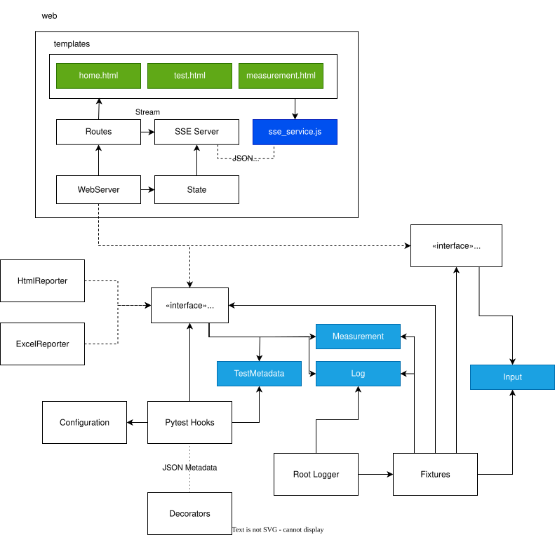

# Architecture

PyProdTest separates pytest integration from consumers of test results and
from the mechanism used to collect operator input.

> **Diagram status:** The diagram describes the original architecture and is
> retained as a useful sketch, but several implementation details are stale.
> See [Diagram update TODOs](#diagram-update-todos).

## Components

### Core

The pytest hooks collect metadata and lifecycle results into `TestRecord`
instances. The core owns these records, captures logs, applies the configured
test order, and forwards lifecycle changes to observers. It also selects one
input acceptor for operator prompts.

### Test observers

`TestObserver` is the one-to-many boundary between the core and result
consumers. Observers receive calls in lifecycle order:

1. `on_tests_start()`
2. `on_tests_collected(test_records)`
3. `on_loop_tests_start(run_index)` for each looped pass
4. `on_test_run(test_record)` and `on_test_end(test_record)` for each test
5. `on_loop_tests_finished(run_index)` after each completed looped pass
6. `on_tests_finished()` at session shutdown

The live web observer publishes the current session state. HTML, JSON, CSV, and
PDF observers retain the records and write their final artifacts at session
shutdown in normal mode, or after each completed pass in looped mode. Observers
consume the domain model and do not depend directly on pytest hook objects.

### Input acceptors

The `input` fixture delegates each prompt to one `InputAcceptor`. A live web run
uses `WebInputAcceptor`; when the UI is disabled, `ConsoleInputAcceptor` reads
from the terminal. Tests therefore use the same fixture in both modes.

This separation allows new observers and input mechanisms without coupling the
pytest hooks to a particular UI or report format. Changes to the domain model
and observer interface require extra care because every consumer depends on
those boundaries.

## Diagram update TODOs

- [ ] Replace the old `WebServer` observer/provider box with the implemented
  `WebObserver`, `LiveState`, and `WebInputAcceptor` responsibilities.
- [ ] Replace `TestInputProvider` with the current `InputAcceptor` interface and
  show both `WebInputAcceptor` and `ConsoleInputAcceptor` implementations.
- [ ] Replace the obsolete `home.html`, `test.html`, and `measurement.html`
  templates with the packaged `index.html`, `app.js`, and CSS assets.
- [ ] Remove the SSE server and `sse_service.js`; the browser currently polls
  the JSON state endpoint and posts operator responses through Flask routes.
- [ ] Show all report observers: HTML, JSON, CSV, and PDF, including their
  shared `ReportsConfig` and finalization at session shutdown.
- [ ] Update the core model to show `TestRecord` and captured logs rather than
  the older metadata/result/log split.
- [ ] Add `pyprodtest.yaml` configuration and test-plan selection to the pytest
  hook flow.
- [ ] Label observer relationships as one-to-many and input-acceptor selection
  as one-per-session, matching the implemented composition.
- [ ] Refresh the legend and component colours after the obsolete web assets
  and data-model boxes are replaced.
