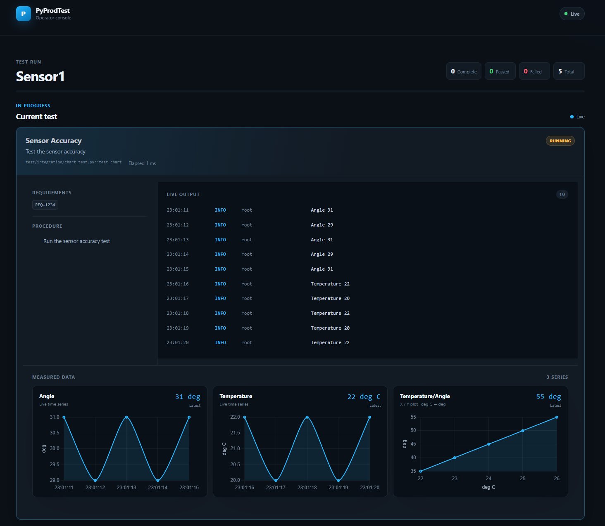

# Unphased

PyProdTest brings operator prompts, a live web view, charts,
and detailed reports to pytest—without enforcing a cumbersome
framework.

[Get started](getting-started.md){ .md-button .md-button--primary }
[View on GitHub](https://github.com/jaydanc/pyprodtest){ .md-button }

<figure class="product-preview" markdown>
  
  <figcaption>Follow the run, review test details, and respond to prompts from one operator console.</figcaption>
</figure>

## What it adds

<div class="grid cards" markdown>

-   :material-account-voice:{ .lg .middle } **Operator input**

    ---

    Ask for text or a yes/no decision from the browser or terminal using one
    fixture.

-   :material-monitor-dashboard:{ .lg .middle } **Live execution view**

    ---

    Follow collection, progress, logs, failures, and active prompts while pytest
    runs.

-   :material-chart-line:{ .lg .middle } **Live measurement charts**

    ---

    Stream timestamped values or explicit X/Y points from tests. Use a different
    series name for each chart and retain the data in final reports. See the
    [`measure` fixture](api.md#measure).

-   :material-file-chart:{ .lg .middle } **Useful reports**

    ---

    Produce timestamped HTML, JSON, CSV, and PDF artifacts from the same test
    records.

</div>

## A complete test

```python
import logging

from pyprodtest import info, req, step


@info("Status light", "Confirm that the device is ready")
@req("REQ-42")
@step("Check that the status light is green")
def test_status_light(input) -> None:
    logging.info("Waiting for the operator")
    assert input("Is the status light green?", bool)
```

Run it with ordinary pytest:

```powershell
uv run pytest
```

PyProdTest does not make tests asynchronous or parallel. Standard pytest runs
them one at a time; the current test blocks while it waits for operator input.

!!! note "Project status"
    PyProdTest is early-stage software and currently requires Python 3.13 or
    newer.
